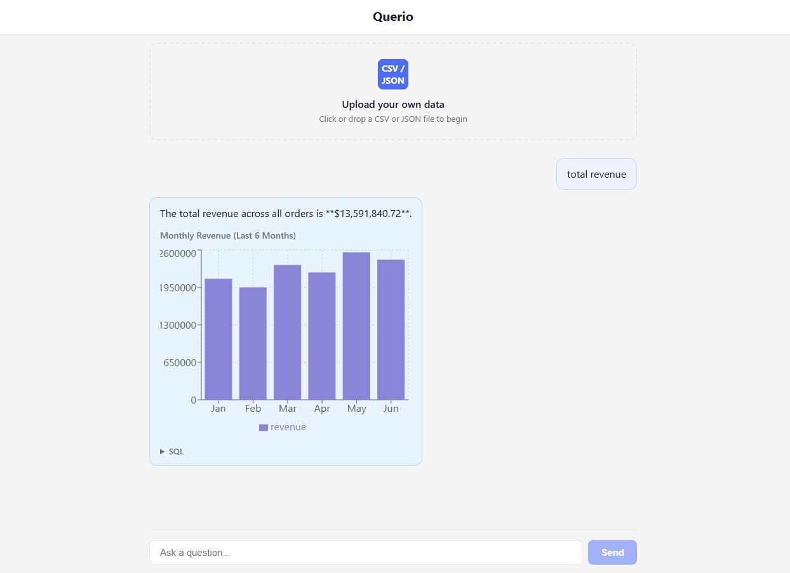

# Querio

### Talk to your data.

Ask a business question in plain English, get a grounded answer pulled from a real Postgres database — with a chart when one actually helps — instead of a wall of SQL you'd have to write yourself.

Built to demonstrate agentic AI engineering: guardrail-validated SQL generation, ambiguity handling, and a provider-agnostic model architecture that runs against Claude, OpenAI, or a fully local model.



---

<!-- written-by: writer-haiku | model: haiku -->

## Quick start

```bash
git clone <repo-url>
cd querio
cp .env.example .env
cp .env.secrets.example .env.secrets
docker compose up
```

Then open `http://localhost:3000` and start asking questions.

**Teardown:**
```bash
docker compose down           # stop containers
docker compose down --volumes # stop containers and reset data
```

Detailed setup, model configuration, and helper scripts → [`docs/SETUP.md`](./docs/SETUP.md)

---

## What it does

- Ask a question like *"What were the top 5 products by revenue last quarter?"* → get a text answer **and** a bar chart.
- Ask something trend-shaped like *"How has monthly signups trended this year?"* → get a line chart.
- Ask something vague like *"Show me customers"* → get asked a clarifying question instead of a wrong answer.
- Every generated query passes through a guardrail validator — `SELECT`-only, row cap, timeout.
- Swap the underlying LLM (Claude / OpenAI / local via Ollama) with a single config change (`MODEL_PROVIDER=` env variable).

## Verified answers & the workbench

- **Badge lifecycle:** answers carry a verification badge — Verified (by a named reviewer), Needs recheck (if underlying schema drifts), Disputed (flagged by any user), or Unverified (new query). Verification is append-only; staleness is automatic, dependency-driven.
- **Verified-query cache:** clean Verified queries skip the LLM pipeline on repeat questions — re-executing only the stored SQL against live data for fresh numbers without recomputation.
- **AnswerCard redesign:** each answer surface shows badge first, then assumptions (compressed when routine, amber-flagged when ambiguous), headline stat, interactive chart (line / bar / histogram / diverging bar / stacked bar, never pie), and a cited summary where every quantitative claim links to source rows or reproducible arithmetic.
- **Linked selection:** tap a citation → highlights the matching chart mark and shows source rows; tap a chart mark → highlights the corresponding claim. Tapping computation-cites opens the workbench without dimming the chart.
- **Chart export:** PNG (2x white background), SVG, and CSV all client-side, with a provenance footer (badge state, run date, row count) that travels into decks — removable in settings.
- **Show the work drawer:** every answer carries a collapsible workbench (navy monospace) with reasoning trace, generated SQL, dependency fingerprints, and cost estimate, so engineers can audit without taxing business users.
- **Clarify responses:** when a question doesn't map to the schema, Querio explains what the dataset contains and offers 2–3 concrete alternatives grounded in the actual data.
- **Confirm-first gate:** highly ambiguous or expensive queries show assumptions as editable chips and wait for confirmation before running, instead of silently guessing.

---

## Why this project exists

Most "AI chatbot" portfolio demos do RAG over documents. Querio does something harder: it generates and safely executes real SQL against a live relational database. That means correctness, guardrails, and ambiguity handling matter far more than retrieval quality.

---

## Project docs

| Document | What it covers |
|---|---|
| [`CONTRIBUTING.md`](./CONTRIBUTING.md) | How to contribute — branching, testing, commit conventions, code of conduct |
| [`ARCHITECTURE.md`](./docs/ARCHITECTURE.md) | System architecture, tech stack, repo tree |
| [`SETUP.md`](./docs/SETUP.md) | Full setup guide, env config, logging, troubleshooting |
| [`DATASET.md`](./docs/DATASET.md) | Olist dataset, raw/marts schemas, data pipeline, Airflow refresh |
| [`DEMO_QUESTIONS.md`](./docs/DEMO_QUESTIONS.md) | Organized demo questions by category |
| [`POC_SRD_NL_Data_Chatbot_v1.3.md`](./docs/POC_SRD_NL_Data_Chatbot_v1.3.md) | Full requirements and architecture decisions |
| [`Querio_User_Journey_Stories_v1.md`](./docs/Querio_User_Journey_Stories_v1.md) | Persona-based stories with acceptance criteria |

---

## Data refresh and scheduling

The Airflow UI runs at `http://localhost:8081`. A scheduled DAG named `scheduled_data_refresh` runs on an hourly schedule, executing the raw-to-marts pipeline (backed by `append_synthetic_orders.py` for data generation, `dbt run` for transformation). Check the Airflow UI for DAG run history, logs, and manual triggers.

---

## Running tests

```bash
pytest --cov
```

Coverage focuses on the guardrail validator, agent tool functions, and the provider adapter interface.

---

## Known limitations

- **Local models are weaker at structured output.** Ollama-hosted models are meaningfully less reliable at function calling / structured SQL generation than Claude or GPT-class models.
- **Single-user by design.** No multi-tenancy; lightweight local accounts (username/password) are prompted only on first verify or share action. Questions do not require login.
- **No write operations.** Querio is read-only, on purpose.
- **Model selection is config-only**, not a UI dropdown.

---

## License

[MIT](LICENSE)
